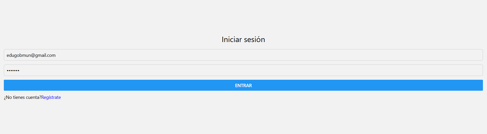

/**
 # Pantalla de inicio de sesión
 * 
 * En este apartado vamos a crear una pantalla de inicio de sesión para nuestra aplicación, controlada a través de tokens JWT.
 * 
 * @returns {JSX.Element} Pantalla de inicio de sesión
 */
export default function LoginScreen() {
  const [email, setEmail] = useState("");
  const [password, setPassword] = useState("");

  /**
   * Valida las entradas del formulario y llama a la api para hacer el login
   */
  const handleLogin = async () => {
    if (!validator.isEmail(email)) {
      Alert.alert("Error", "El email no es válido.");
      return;
    }
    if (!validator.isStrongPassword(password)) {
      Alert.alert("Error", "La contraseña no es segura!!!");
      return;
    }

    try {
      const token = await authApiService.loginUser(email, password);

      if (token == "" || token == null) {
        Alert.alert("Error", `Not logged, invalid user or password.`);
        return;
      }

      await authStorageService.saveToken(token);
      Alert.alert("Succesful", `Logeado\n Mastodonte Crack Titán Guapo!`);

      setEmail("");
      setPassword("");

      router.push("./(drawer)/welcome");
    } catch (error) {
      console.log(error);
    }
  };

  return (
    <View style={{ flex: 1, justifyContent: "center", alignItems: "center" }}>
      <TextInput
        style={styles.input}
        placeholder="Email"
        value={email}
        onChangeText={(text) => setEmail(text)}
      />
      <TextInput
        style={styles.input}
        placeholder="Contraseña"
        value={password}
        onChangeText={(text) => setPassword(text)}
        secureTextEntry={true}
      />
      <Button title="Entrar" onPress={handleLogin} />
    </View>
  );
}

const styles = StyleSheet.create({
  container: { flex: 1, justifyContent: "center", alignItems: "center" },
  input: { borderWidth: 1, borderColor: "#ccc", padding: 8, marginBottom: 12, borderRadius: 6 },
});

[Volver](../Readme.md)