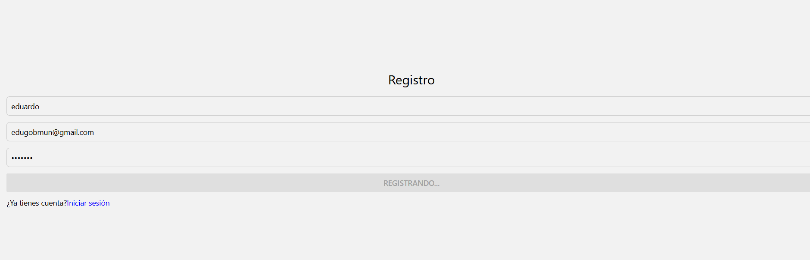

# Ejercicio 1: Pantalla de Registro de Usuario
==============================

Este proyecto utiliza Expo Router junto con React Navigation Drawer para implementar un menú lateral (Drawer).

## Objetivo
-----------

Cree una pantalla de registro de usuario en React Native que cumpla con los siguientes requisitos:

* Entradas para nombre completo, correo electrónico y contraseña.
* Validación de los datos ingresados.
* Envío de los datos a la API de registro.
* Mostrar mensajes de éxito o error.
* Redirigir a la pantalla de inicio de sesión tras un registro exitoso.

 Primero, creamos el archivo registerScreen.tsx que será nuestra pantalla de registro, contiene 3 entradas de un formulario y un botón para enviar el formulario. Cuando se envía el formulario, recoge los datos del mismo y los envía a la API del bellezon de adrián con el verbo POST para enviar los datos del nuevo usuario.

Ya lo podemos cerrar del todo 🔒💪 ( es broma profe apruebame te lo pido de la forma mas bonita que se abriendote las puertas de mi corazon (º _ º)                   
                                                                                                        (ya no se ni que hago))

/**
 * Pantalla de Registro de Usuario
 * @returns {JSX.Element} - Elemento JSX de la pantalla de registro
 */
export default function RegisterScreen() {
  const [fullName, setFullName] = useState(""); // Estado para guardar el nombre completo del usuario
  const [email, setEmail] = useState(""); // Estado para guardar el correo electrónico del usuario
  const [password, setPassword] = useState(""); // Estado para guardar la contraseña del usuario
  const [loading, setLoading] = useState(false); // Estado para guardar si se está cargando la pantalla o no

  const validateEmail = (email: string) => { // Función para validar si un correo electrónico es válido
    // Expresión regular para validar email
    const re = /^[^\s@]+@[^\s@]+\.[^\s@]+$/;
    return re.test(String(email).toLowerCase());
  };

  const validatePassword = (pw: string) => { // Función para validar si una contraseña es válida
    // Expresión regular para validar password
    return /^(?=.*[A-Za-z])(?=.*\d).{6,}$/.test(pw);
  };

  const onRegister = async () => { // Función para manejar el envío del formulario
    // Validación de los campos
    if (!fullName.trim()) {
      Alert.alert("Error", "Introduce tu nombre completo.");
      return;
    }
    if (!validateEmail(email)) {
      Alert.alert("Error", "Introduce un email válido.");
      return;
    }
    if (!validatePassword(password)) {
      Alert.alert(
        "Error",
        "La contraseña debe tener al menos 6 caracteres y contener letras y números."
      );
      return;
    }

    setLoading(true);
    try {
      // Envío de los datos a la API de registro
      const res = await serviceApi.register(fullName, email, password);

      // Manejo genérico de respuesta
      if (res.status === 201 || res.status === 200) {
        Alert.alert("Registro correcto", "Usuario registrado correctamente.");
        router.navigate("Login");
      } else {
        Alert.alert(
          "Registro",
          res.data?.message || "Respuesta del servidor inesperada."
        );
      }
    } catch (err) {
      console.error(err);
      Alert.alert("Error", "No se pudo registrar el usuario.");
    } finally {
      setLoading(false);
    }
  };

  return (
    <View style={styles.container}>
      <Text style={styles.title}>Registro</Text>
      <TextInput
        style={styles.input}
        placeholder="Nombre completo"
        value={fullName}
        onChangeText={setFullName}
      />
      <TextInput
        style={styles.input}
        placeholder="Email"
        value={email}
        onChangeText={setEmail}
        keyboardType="email-address"
        autoCapitalize="none"
      />
      <TextInput
        style={styles.input}
        placeholder="Contraseña"
        value={password}
        onChangeText={setPassword}
        secureTextEntry
      />
      <Button
        title={loading ? "Registrando..." : "Registrarse"}
        onPress={onRegister}
        disabled={loading}
      />
      <View style={{ flexDirection: "row", marginTop: 10 }}>
        <Text>¿Ya tienes cuenta? </Text>
        <TouchableOpacity onPress={() => router.navigate("Login")}>
          <Text style={{ color: "blue" }}>Inicia sesión</Text>
        </TouchableOpacity>
      </View>
    </View>
  );
}

const styles = StyleSheet.create({
  container: { flex: 1, padding: 16, justifyContent: "center" },
  title: { fontSize: 24, marginBottom: 16, textAlign: "center" },
  input: {
    borderWidth: 1,
    borderColor: "#ccc",
    padding: 8,
    marginBottom: 12,
    borderRadius: 6,
  },

[Volver](../Readme.md)