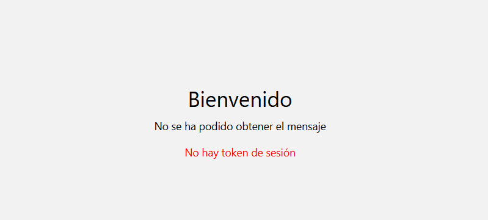

# Documentación del Welcome

El Welcome es un componente que se encarga de mostrar una pantalla de bienvenida al usuario. Este componente llama a la función buttonDisplayToken() que se encarga de llamar al servicio de la Api y hacer una petición al endpoint Get(/welcomes) y mostrar con un Alert el mensaje de lo que devuelve el endpoint.

# Explicación del código

El Welcome es un componente que se encarga de mostrar una pantalla de bienvenida al usuario. Este componente utiliza el hook useState para crear dos estados: welcomeMessage y error.

El estado welcomeMessage se utiliza para mostrar el mensaje de bienvenida devuelto por el endpoint Get(/welcomes) de la Api y el estado error se utiliza para mostrar un mensaje de error si no se puede obtener el mensaje de bienvenida.

El hook useEffect se utiliza para llamar a la función getWelcomeMessage cuando el componente se monta. La función getWelcomeMessage se encarga de obtener el token de sesión con la función getToken() del servicio AuthService y hacer una petición al endpoint Get(/welcomes) de la Api con el token de sesión obtenido.

Si el endpoint devuelve un mensaje, se setea el estado welcomeMessage con el mensaje devuelto. Si no se puede obtener el mensaje, se setea el estado error con un mensaje de error.

El componente renderiza una pantalla con un título de "Bienvenido", un párrafo con el mensaje de bienvenida y un párrafo con un mensaje de error si no se puede obtener el mensaje de bienvenida.

[Volver](../Readme.md)